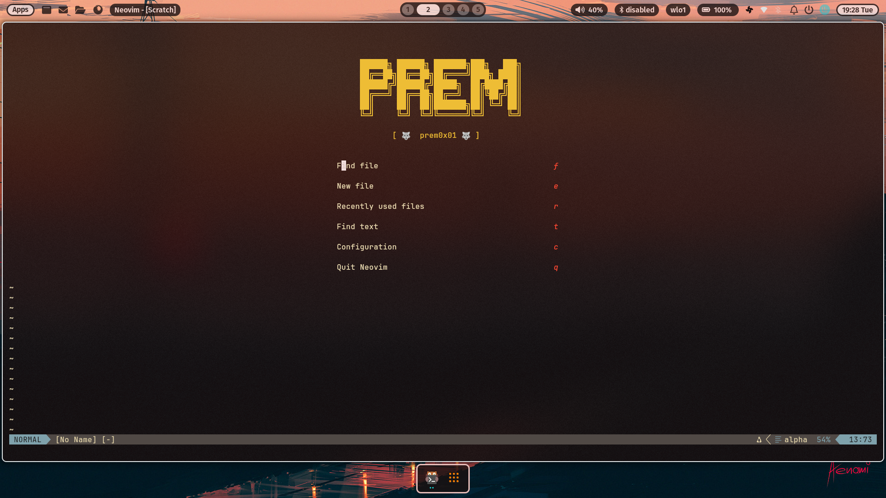

# Neovim IDE Configuration

Welcome to my Neovim configuration. This setup is designed to provide a fast, modern, and highly customizable development environment using Lua and Lazy.nvim.

Whether you're working with Lua, Go, Python, Markdown, or web development, this configuration offers useful tools and features to streamline your workflow.

## Screenshot



## Features

- Lazy-loading plugin manager (`lazy.nvim`)
- LSP integration with autocompletion, diagnostics, and code actions
- Syntax highlighting and code folding via Treesitter
- Git integration with signs, diffview, and inline blame
- File navigation with `nvim-tree` and fuzzy finder with `telescope`
- Buffer management with close buttons and clean indicators
- Statusline, bufferline, and UI polish for a smooth experience
- Automatic formatting and autosave support
- Inlay hints and floating diagnostics
- Code snippets with `LuaSnip` and VSCode-style expansions
- Optional dashboard, session management, scroll enhancements, and more

## Requirements

- Neovim 0.9+ with Lua support
- A Nerd Font-enabled terminal
- Git (for plugin cloning)
- LSP servers installed (recommended via `mason.nvim`)

## Setup

Clone the config into your Neovim directory:

```bash
git clone https://github.com/prem0x01/NeovimConfig ~/.config/nvim
````

Install plugins:

1. Open Neovim
2. Lazy.nvim will bootstrap itself and install everything
3. Restart Neovim after the first load

## File Structure

```
nvim/
├── init.lua
├── lua/
│   ├── core/
│   │   ├── init.lua
│   │   ├── options.lua
│   │   ├── keymaps.lua
│   │   ├── autocommands.lua
│   │   ├── theme.lua
│   │   └── lsp.lua
│   ├── plugins/
│   │   ├── init.lua
│   │   ├── cmp.lua
│   │   ├── telescope.lua
│   │   ├── lualine.lua
│   │   ├── treesitter.lua
│   │   ├── gitsigns.lua
│   │   ├── markdown.lua
│   │   ├── ui.lua
│   │   ├── bufferline.lua
│   │   ├── harpoon.lua
│   │   ├── session.lua
│   │   ├── autopairs.lua
│   │   ├── formatting.lua
│   │   ├── clipboard.lua
│   │   └── (more optional modules)
│   └── utils/
│       └── init.lua
```
